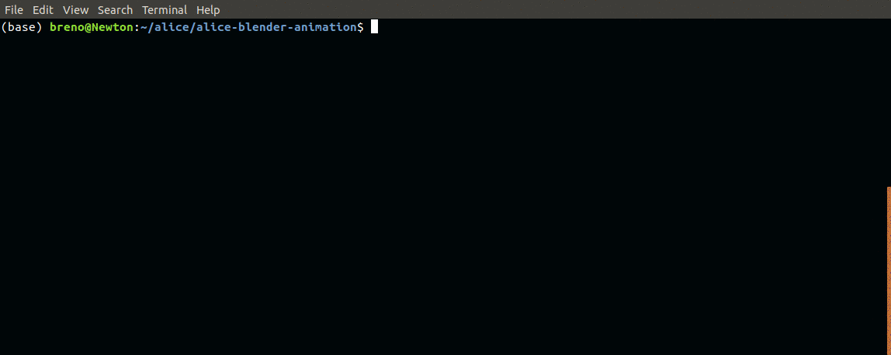

# ALICE Open Data Blender animation

## Visit the Animation Sample Webpage at https://animalicedata.github.io/sampleanimations/

# Table of Contents

1. [Project Description](#description)
    1. [How it all works](#how-works)
2. [Getting started](#getting-started)
3. [Running the code](#run-code)
    1. [Workflow Options](#options)
4. [Default animation](#default)
5. [Running Examples](#running)
    1. [Choosing multiplicity range](#multi)
    2. [One event, one camera](#one-one)
    3. [Mosaic](#mosaic)
    4. [Minimum Average Pz option](#minavgpz)
6. [License](#license)


# Project Description <a name="description"></a>

This project has the purpose of generating 3D animations of ALICE particle collision events using data obtained from CERN's Open Data Portal. ALICE stands for "A Large Ion Collider Experiment" and it is a particle detector inside the LHC - Large Hadron Collider -, the world's largest and highest-energy particle collider, located beneath the France–Switzerland border. CERN stands for *Organisation européenne pour la recherche nucléaire*, which is French for European Organization for Nuclear Research, and it is the home of LHC. CERN's Open Data Portal is an open online platform that contains data files from particle physics; those include the ESDs - Event Summary Data files -, which hold information about ALICE events and are of great help making the animations look like real representations of such events.

## How it all works <a name="how-works"></a>

Before diving into how to run this project, it is important to develop some intuition on how the pieces all fit together to make the whole thing work out just right.

The animation of a particle collision event is generated through 3D modeling software, which sets the position of all the particles at any given time - until the animation is over - with the help of their respective mass, charge and initial linear momentum values, plus the value of the magnetic field and the collision vertex, a spot from which we consider all the particles originate.

All this information must be obtained from somewhere - that somewhere is the above-mentioned ESD files, which contain data about several events each. The ESDs come in a *.root* extension and may only be interpreted by ROOT, CERN's official software for particle physics analysis. This is done through C++ code, which is written in order to specifically refer to the ESD desired data, in accordance with the available libraries, and run by ROOT to export this data to textual format. That is why the download of Aliroot, ROOT's version for ALICE events analysis, is required.

The text files containing all the physics data are then read by the Python scripts responsible for generating the animation, completing the procedure.

The whole process is a lot more user-friendly than it may seem at first glance; except for installing a couple of programs - ROOT and Blender -, the only thing left for the user to do is run a line of code from the terminal, which executes a script that automatizes everything from running ROOT to rendering and saving every animation *.mp4* file. The final result is a directory inside of which is a series of animation clips, each one corresponding to a different event in the chosen ESD file.

# Getting started <a name="getting-started"></a>

This project was developed in Ubuntu 18.04 version of Linux, therefore this is the recommended OS for running it.

First, create a directory to keep everything:

```bash
$ mkdir -p ~/alice
```

Enter this directory:

```bash
$ cd ~/alice
```

If you haven't yet, clone the project's repository:

```bash
$ git clone https://git.cta.if.ufrgs.br/ALICE-open-data/alice-blender-animation.git
```

Make sure the repository is inside the `alice` directory you created.

It is then time to download Blender, a free and open source software that is used for animating events. Stick to version 2.79b, or there is no
guarantee the code will work.

```bash
$ wget https://download.blender.org/release/Blender2.79/blender-2.79b-linux-glibc219-x86_64.tar.bz2
```

Extract files from package:

```bash
$ tar -jxvf blender-2.79b-linux-glibc219-x86_64.tar.bz2
```

Now, install FFmpeg, a free and open-source software project designed for handling video, 
audio, and other multimedia files and streams.

```bash
$ sudo apt update
$ sudo apt install ffmpeg
```

The next step is to install Aliroot, which is CERN's official software for ALICE physics analysis, so you are able to process the relevant information
for the events.

In case you are not conCERNed about the data being used for the animation and only wish to generate a standard one, skip to the
Default Animation section below.

Here is the sequence of steps for installing Aliroot:

1) Install aliBuild. Follow instructions on https://alice-doc.github.io/alice-analysis-tutorial/building/custom.html

2) Initialize AliPhysics

```bash
cd ~/alice
aliBuild init AliPhysics@master
```

3) Verify dependencies (Optional)

```bash
$ aliDoctor AliPhysics
```

4) Build AliPhysics with aliroot5 (this may take a long time)

```bash
aliBuild build AliPhysics --defaults user -z aliroot5
```

To make sure Aliroot was installed successfully, enter the ALICE environment, alienv:

```bash
$ alienv enter AliPhysics/latest-aliroot5-user
```

In order to see how this is supposed to go, you may want to check the instructions on [how to open a TBrowser](#TBrowser), further down.
To exit, simply enter:

```bash
$ exit
```

# Running the code <a name="run-code"></a>

At this point, you are ready to pick an ESD file at CERN's Open Data Portal. ESD files regarding the ALICE experiment can be found on
http://opendata.cern.ch/search?page=1&size=20&experiment=ALICE. You can either manually download your ESD file and save it in the
project's repository directory (in the same path as this `README.md` file), under the name `AliESDs.root`, or have your ESD be downloaded automatically, as explained
further.

Once you're all set, all there is left to do is run the `workflow_sketch.sh` script through your terminal. Don't forget to access the project's repository
directory first:

```bash
$ cd ~/alice/alice-blender-animation
```

The script offers several options in order to personalize the output. For example, in order to set the number of frames per second (fps) to 24 and the video
time duration to 8 seconds, one should run the command like this:

```bash
./workflow_sketch.sh --fps 24 -t 8
```

As you can see, options are either preceded by double dashes (as in `--fps 24`) or by a single dash (as in `-t 8`). The option's value should follow
the option's name, also separated by a space. Some options, such as the `--download` option, don't expect arguments. When any available option is not called, it runs
the code with its standard value. See below for a detailed list of all the available options, which can also be checked out by entering:

```bash
./workflow_sketch.sh --help
```

In case you have chosen the automatic ESD download option, run the code as:

```bash
./workflow_sketch.sh --url <URL> --download
```

where ``<URL>`` is the URL address for the chosen ESD file. Of course, you can add other options as well, if you wish.

Here's an example of the procedure, using an ESD from the list identified as *Pb-Pb data sample at the collision energy of 2.76 TeV per nucleon pair from run number 139465*, at CERN's Open Data Portal:

1. Go to http://opendata.cern.ch/record/1106 and scroll until *File indexes*, then click "List Files":


2. Pick an ESD of your choice, then right-click the download arrow and copy its URL:


3. In the terminal, run the main script appropriately:

```bash
$ ./workflow_sketch.sh --download --url http://opendata.cern.ch/record/1106/files/assets/alice/2010/LHC10h/000139465/ESD/0433/AliESDs.root
```


Here's another working example, including
the download option:

```bash
./workflow_sketch.sh --url http://opendata.cern.ch/record/1103/files/assets/alice/2010/LHC10h/000139173/ESD/0004/AliESDs.root --download -t 4 --cameras Overview,Forward
```

Needless to say, if you run the code again after you've already downloaded the ESD the first time, there is no longer need
to type in the `--download` and `--url` options.

## Workflow options <a name="options"></a>

   ---------------------------------------------------------------------------------------------------------------------
     Option             Entry                     Action                                                 Standard Value
   ------------------- ------------------------- ------------------------------------------------------ ----------------
     -h or --help       none                      Shows a list with all possible using options.                 -

     -d or
     --download         none                      Informs to download the ESD file, rather than trying          -
                                                  to find one locally

     -u or --url        ESD file URL              Informs ESD file URL, in case download option is              -
                                                  called

     -m ou              Positive integer          Sets the maximum number of particles allowed in the         1000
     --maxparticles                               events to be animated.

     --minparticles     Positive integer          Sets the minimum number of particles allowed in the           0
                                                  events to be animated.

     -n or              Non-negative integer      Sets number of events to be animated inside chosen           10
     --numberofevents                             ESD file

     --minavgpz         Positive number           Gets only events for which the absolute value of              0
                                                  average momentum in the z direction is greater than
                                                  or equal to the specified value, in GeV/c. Useful
                                                  for animating events with 'boosts' of particles to
                                                  the same side.

     --minavgpt         Positive number           Get only events for which the average transversal             0
                                                  momentum is greater than or equal to the specified
                                                  value, in GeV/c. Useful for animating events with
                                                  'boosts' of particles on the xy plane.
     -t or
     --duration         Positive integer          Sets animation duration, in seconds                          10

     -r ou --radius     Positive number           Scales the particle's radius to the informed value            1

     --resolution       Whole number from         Sets animation resolution percentage.                       100
                        1 to 100

     --fps              Positive integer          Sets animation number of frames per second                   24

     --transparency     Positive number           Sets detector transparency, where zero is full                1
                                                  transparency and 1 is standard transparency

     -c ou --cameras    Comma-separated list      Sets cameras to animate events with                       Overview
                        (with no spaces) of
                        cameras. Options:
                        Barrel, Forward,
                        Overview, Side,
                        Moving1, Moving2,
                        Moving3, Moving4

     --mosaic           none                      Makes animations in four different cameras (Barrel,           -
                                                  Forward, Overview and Moving1) and combines them
                                                  into a single 2x2 clip containing all four
                                                  perspectives.

     --picpct           Whole number from         Informs percentage of animation to take HD picture,          80
                        1 to 100                  saved along with the clip.

     --bgshade          Number from 0 to 1        Set background shade of black to VALUE, where 0 is            0
                                                  totally black and 1 is totally white.

     -a ou --sample     none                      Creates a sample Blender animation of Event 2 from            -
                                                  URL http://opendata.cern.ch/record/1102/files/asset
                                                  s/alice/2010/LHC10h/000139038/ESD/0001/AliESDs.root

     --its              none                      Removes ITS detector from animation                           -

     --detailedtpc      none                      Includes a more detailed version of the TPC                   -
                                                  geometry, made by researcher Stefan Rossegger
                                                  (stefan.rossegger@gmail.com)

     --tpc              none                      Removes TPC detector from animation                           -

     --trd              none                      Removes TRD detector from animation                           -

     --emcal            none                      Removes EMCal detector from animation                         -

     --blendersave      none                      Saves Blender file along with animation clip                  -
   -----------------------------------------------------------------------


After running the script, it may take a long time to generate all the animations, but as soon as it is done, they will be available inside a new directory uniquely
identified according to the chosen ESD file. Each clip is also identified by event number. Enjoy!


# Default Animation <a name="default"></a>

For generating a default animation, simply run the script `workflow_sketch.sh` in your terminal as below, from inside the project's repository directory:

```bash
./workflow_sketch.sh -a
```

After this, a single default animation should be ready. It will be available inside the `blender` directory, in *.mp4* format. Enjoy! You may want to check the table
above for information on the using options.

# Running Examples <a name="running"></a>

Here are some running examples to illustrate how to run the code and make some animations.

## Choosing multiplicity range <a name="multi"></a>

An event's multiplicity is the number of particles in it. In the following example, the code only animates events with multiplicity
within the specified range, which is a minimum of 20 particles and a maximum of 300:

```bash
$ ./workflow_sketch.sh --minparticles 20 --maxparticles 300
```


## One event, one camera <a name="one-one"></a>

One of the simplest ways to run the code is to just animate one event, using only one of the available cameras. The ```bash -m ``` option is just an alternative way to use the --maxparticles option, showed above. Hence, the following example will generate a single
clip, from the Forward Camera perspective, with no more than 100 particles:

```bash
$ ./workflow_sketch.sh -n 1 -c Forward -m 100
```


## Mosaic <a name="mosaic"></a>

One of the coolest options available is the mosaic option. For every selected event, it generates animations in four different cameras - one of them with shifting perspective - and combines them into a single 2x2 clip containing all four of them.

```bash
$ ./workflow_sketch.sh --mosaic -m 100
```



Here's a peak of what the result is like:


## Minimum Average Pz option <a name="minavgpz"></a>

**Pz** is the physical quantity of the particle's z direction (relativistic) momentum. The z direction is the one parallel to
the collision direction, also the axial direction of the detector. Positive values for momentum represent
particles that go one way, while negative values indicate particles that go the other - basic physics convention.

One of the features
of this code is that it computes the average value of z momentum for each event, given by the sum of every particle's Pz value
divided by the total number of particles. Evidently, a lot of the negative values cancel out the positive ones, only to leave us
with a resulting value that may be either negative or positive. Once this is done, we take the *absolute value* of this result as a
way to express, in a sense, "how much" the particles tend to go one way *rather* than the other - regardless of which way.

(You may think this sum is always going to be zero because
of conservation of momentum, but it turns out because of some instability in the center of mass of the initial colliding
packages, it is usually not. Plus, there may be particles, such as muons, that aren't being taken into account
because their data is stored separately.)

When running the code, you may choose to only animate events that have this quantity - the absolute value of the average of
the z direction momentum values (phew!) - greater than a certain number, measured in GeV/c. This way, you may select events
that have "boosts" of particles to the same side, as in the following image.


This is done by using the `--minavgpz` option, like so:

```bash
$ ./workflow_sketch.sh --minavgpz 0.5
```


But how do we figure out a reasonable value to run the code with, given our chosen ESD?
As the first step of the animation making, the Aliroot software performs an analysis on the ESD file, in order to
extract the relevant information. As a bonus, it also generates frequency histograms of some physical quantities, such as the one
at hand. To be able to access these histograms in the first place, though, you must have run the analysis at least once.
You can run the analysis on your ESD file without making any unwanted animations by simply choosing to animate zero events:

```bash
$ ./workflow_sketch.sh -n 0
```


Then you must run Aliroot so you can browse *.root* files through what is called a TBrowser: <a name="TBrowser"></a>

```bash
$ alienv enter AliPhysics/latest-aliroot5-user
$ aliroot
$ new TBrowser
```


A window should open, where you can access the histograms in the path indicated:

```bash
-> alice
  -> alice-blender-animation
    -> aliRoot
      -> AnalysisResults.root
        -> MyTask;1
          -> MyOutputContainer;1
```


There you have it: a histogram that shows how many events are within each interval of our desired quantity, in GeV/c. That way,
you can have an idea how its distribution behaves inside a given ESD, thus know what values should "do the trick".

To exit ROOT, enter

```bash
$ exit()
```

Then, to exit the ALICE environment (alienv):

```bash
$ exit
```

# License  <a name="license"></a>

This project is licensed under the GNU General Public License v3.0

A copy of this license is provided in the [LICENSE](LICENSE) file.
